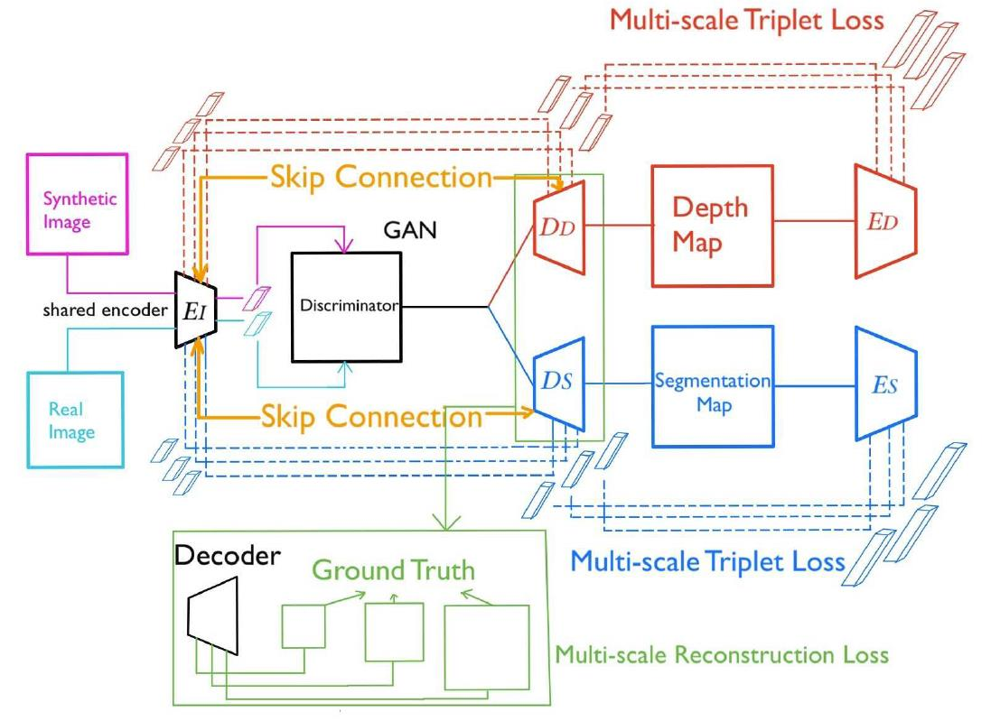

# DASGIL
DASGIL: Domain Adaptation for Semantic and Geometric-aware Image-based Localization, RAL & IROS 2020, by [Hanjiang Hu](https://github.com/HanjiangHu),[Ming Cheng](https://github.com/MingCheng991129), etc.

Code and pretrained model will be available soon.

#### Test Pipeline

  

#### Architecture Overview

  

#### Results on KITTI

  

#### Results on CMU Seasons

Image Retrieval on Extended CMU Seasons: [Results](https://www.visuallocalization.net/details/3479/)

  
