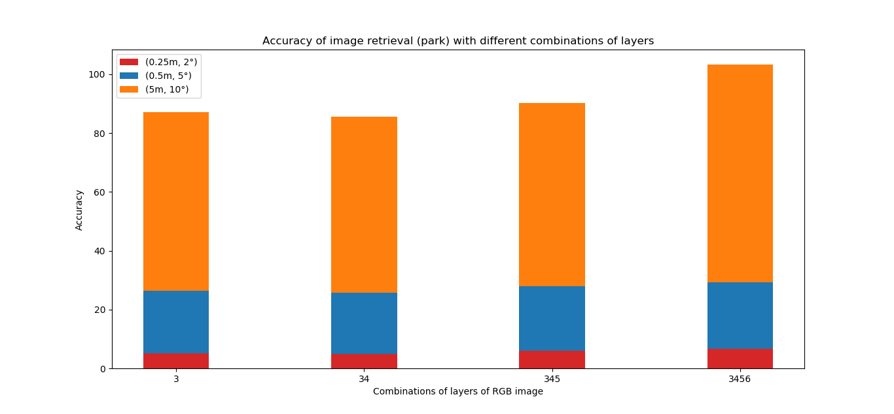

# DASGIL
DASGIL: Domain Adaptation for Semantic and Geometric-aware Image-based Localization, RAL & IROS 2020, by [Hanjiang Hu](https://github.com/HanjiangHu),[Ming Cheng](https://github.com/MingCheng991129), etc.

Code and pretrained model will be available soon.

Test Pipeline

  
Architecture Overview

  
Results on KITTI

  
Results on CMU Seasons

  
Image Retrieval on Extended CMU Seasons: [Results](https://www.visuallocalization.net/details/3479/)

